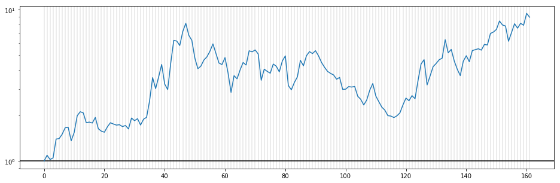

# FX_prediction_by_LSTM

LSTMを用いてFX(EUR/USD)の日足の変化率を予測する．  
モデルを300程度作り，アンサンブル．  
単純な精度(利益になった割合)は53~54%程度となった．  

データはoanda apiから取得．  
2005/01/01 ~ 2017/12/31の日足(始値，安値，高値，終値，取引量)．  

チューニングの余地あり．  

上記期間での予測結果の推移は下図．  

つまり，掛金が常に一定で13年間で76%程度の利益が得られた．  
一定期間ごとに掛金を更新，レバレッジをあげるなどすれば，より大きい利益を得られる．  
もちろんその分リスクも上がるので調整する必要がある．  

下図は，一定期間(20営業日)ごとにそのときの資産のレバレッジ5倍になるよう掛金を更新したときの資産推移(倍率)．

結果として8.9倍となった．  

詳しく確認していないが，リーマンショックなどの大きいイベント前に予測が当たり，イベント後に間違える傾向にあるような気がする．

今の所大したことはしていないが，前処理，モデル，学習手法については公開しない．
